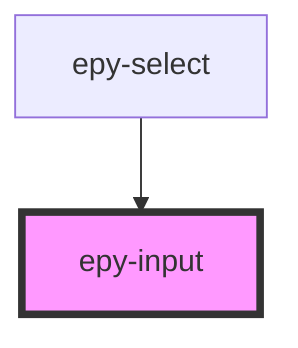

# epy-input

<!-- Auto Generated Below -->

## Properties

| Property           | Attribute           | Description | Type      | Default     |
| ------------------ | ------------------- | ----------- | --------- | ----------- |
| `clear`            | `clear`             |             | `boolean` | `undefined` |
| `disabled`         | `disabled`          |             | `boolean` | `undefined` |
| `errorLabel`       | `error-label`       |             | `string`  | `undefined` |
| `inputType`        | `input-type`        |             | `string`  | `undefined` |
| `label`            | `label`             |             | `string`  | `undefined` |
| `labelHelper`      | `label-helper`      |             | `string`  | `undefined` |
| `maxlength`        | `maxlength`         |             | `number`  | `undefined` |
| `minlength`        | `minlength`         |             | `number`  | `undefined` |
| `placeholder`      | `placeholder`       |             | `string`  | `undefined` |
| `required`         | `required`          |             | `boolean` | `undefined` |
| `requiredLabel`    | `required-label`    |             | `string`  | `undefined` |
| `rows`             | `rows`              |             | `number`  | `undefined` |
| `type`             | `type`              |             | `string`  | `undefined` |
| `validationStatus` | `validation-status` |             | `string`  | `undefined` |
| `value`            | `value`             |             | `any`     | `undefined` |

## Events

| Event       | Description | Type               |
| ----------- | ----------- | ------------------ |
| `epychange` |             | `CustomEvent<any>` |

## Dependencies

### Used by

 - [epy-select](../epy-select)

### Graph

----------------------------------------------

*Built with [StencilJS](https://stenciljs.com/)*
