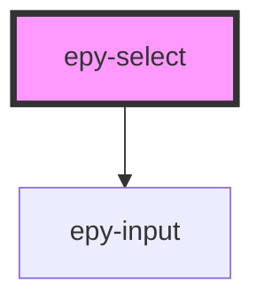

# epy-select

<!-- Auto Generated Below -->

## Properties

| Property            | Attribute            | Description | Type                       | Default              |
| ------------------- | -------------------- | ----------- | -------------------------- | -------------------- |
| `epyClass`          | `epy-class`          |             | `string`                   | `"select-outline"`   |
| `filter`            | `filter`             |             | `boolean`                  | `false`              |
| `filterPlaceholder` | `filter-placeholder` |             | `string`                   | `"Search"`           |
| `label`             | `label`              |             | `string`                   | `undefined`          |
| `labelHelper`       | `label-helper`       |             | `string`                   | `undefined`          |
| `leftIcon`          | `left-icon`          |             | `string`                   | `undefined`          |
| `notFoundCopy`      | `not-found-copy`     |             | `string`                   | `"Nothing found"`    |
| `options`           | --                   |             | `(string \| SelectItem)[]` | `[]`                 |
| `placeholder`       | `placeholder`        |             | `string`                   | `"Select an option"` |
| `rightIcon`         | `right-icon`         |             | `string`                   | `"arrow arrow-open"` |
| `textColor`         | `text-color`         |             | `string`                   | `undefined`          |
| `value`             | `value`              |             | `any`                      | `undefined`          |

## Events

| Event          | Description | Type               |
| -------------- | ----------- | ------------------ |
| `selectChange` |             | `CustomEvent<any>` |

## Dependencies

### Depends on

- [epy-input](../epy-input)

### Graph

----------------------------------------------

*Built with [StencilJS](https://stenciljs.com/)*
